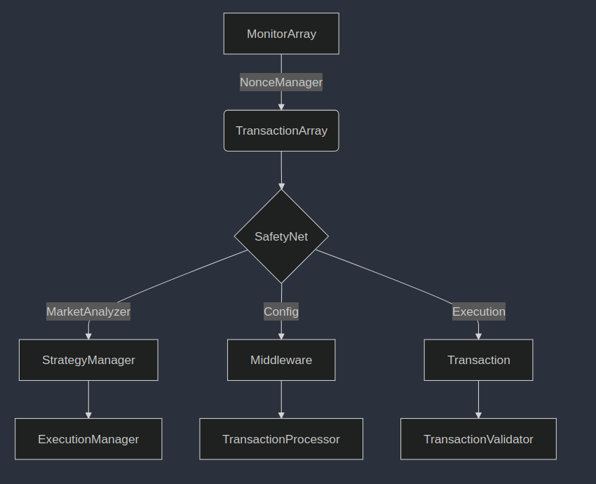

# 0xBuilder


[](LICENSE)
[](CONTRIBUTING.md)

[](https://www.python.org/downloads/release/python-3120/)
[](https://nodejs.org/en/download/)
[](https://docs.soliditylang.org/en/v0.8.19/)
[](https://geth.ethereum.org/)
[](https://remix.ethereum.org/) 

[](https://aave.com/)
[](https://uniswap.org/)
[](https://sushiswap_router_abi.fi/)
[](https://pancakeswap_router_abi.finance/)
[](https://balancer.finance/)

[](https://infura.io/)
[](https://www.coingecko.com/en/api)
[](https://coinmarketcap.com/api/)
[](https://min-api.cryptocompare.com/)
[](https://etherscan.io/apis)
   

## Table of Contents

- [Introduction](#introduction)
- [Features](#features)
- [Project Structure](#project-structure)
- [Prerequisites](#prerequisites)
  - [System Requirements](#system-requirements)
  - [Software Dependencies](#software-dependencies)
  - [Ethereum Node Setup](#ethereum-node-setup)
- [Installation](#installation)
  - [Cloning the Repository](#cloning-the-repository)
  - [Setting up Python Environment](#setting-up-python-environment)
  - [Setting up JavaScript Environment](#setting-up-javascript-environment)
- [Configuration](#configuration)
  - [Environment Variables](#environment-variables)
  - [Configuration Files](#configuration-files)
- [Deploying the Flashloan Contract](#deploying-the-flashloan-contract)
- [Obtaining API Keys](#obtaining-api-keys)
- [Running the Bot](#running-the-bot)
  - [Python](#Python)
  - [Javascript](#Javascript)
- [Strategies](#strategies)
- [Logging](#logging)
- [Troubleshooting](#troubleshooting)
- [Contributing](#contributing)
- [License](#license)
- [Disclaimer](#disclaimer)

## Introduction

**0xBuilder** is an advanced Ethereum MEV bot designed for high-frequency trading and MEV (Maximal Extractable Value) opportunities. The bot leverages multiple advanced components for mempool monitoring, real-time market analysis, and efficient transaction execution with comprehensive risk management and safety checks.

## Core Features

- **Advanced Mempool Monitoring**
  - Real-time transaction monitoring with parallel processing
  - Smart filtering and deduplication of transactions
  - Automatic failover between filter and polling-based monitoring
  - Dynamic batch processing with configurable concurrency limits

- **Sophisticated Market Analysis**
  - Real-time price analysis using multiple data sources
  - Machine learning-based price movement predictions
  - Advanced volatility and market condition monitoring
  - Historical price analysis with caching
  - Multi-source volume and liquidity tracking

- **Dynamic Strategy Execution**
  - Reinforcement learning-based strategy selection
  - Adaptive slippage tolerance
  - Multiple execution strategies including:
    - High-value ETH transfer strategy
    - Aggressive front-running with risk assessment
    - Predictive front-running with market analysis
    - Volatility-based front-running
    - Advanced back-running strategies
    - Flash loan-based strategies
    - Price boost sandwich attacks
    - Arbitrage-based sandwich attacks

- **Transaction Management**
  - Advanced nonce management with caching
  - Dynamic gas price optimization
  - EIP-1559 support
  - Smart transaction bundling
  - Automatic transaction retry with exponential backoff

- **Risk Management & Safety**
  - Real-time profit verification
  - Dynamic risk scoring
  - Multi-factor market condition analysis
  - Gas cost optimization
  - Smart contract interaction validation
  - Comprehensive error handling and recovery

- **API Integration**
  - Rate-limited API access
  - Multiple provider fallback
  - Smart caching with TTL
  - Automatic failover between providers
  - Weighted price aggregation

## Project Structure

```
/0xBuilder/
├── Python/
│   ├── Configuration/
│   │   └── Configuration.py               # Configuration management
│   │   └── DataApiClient.py               # API client for external data sources
│   ├── Core/
│   │   ├── MainCore.py                   # Main bot script
│   │   ├── NonceCore.py                  # Manages Ethereum nonces
│   │   ├── StrategyNet.py                # Handles trading strategies
│   │   └── TransactionCore.py            # Builds and sends transaction bundles
│   ├── utils/
│   │   ├── token_addresses.json           # List of monitored token addresses
│   │   ├── token_symbols.json             # Mapping of token addresses to symbols
│   │   └── erc20_signatures.json          # ERC20 function signatures
│   ├── abi/
│   │   ├── erc20_abi.json
│   │   ├── AAVE_FLASHLOAN_abi.json
│   │   ├── AAVE_LENDING_POOL_abi.json
│   │   ├── uniswap_router_abi.json
│   │   ├── sushiswap_router_abi.json
│   │   ├── pancakeswap_router_abi.json
│   │   └── balancer_router_abi.json
│   ├── Contracts/
│   │   └── SimpleFlashLoan.sol             # Flashloan smart contract
│   ├── Analysis/
│   │   ├── MarketMonitor.py              # Analyzes market data
│   │   ├── MempoolMonitor.py             # Monitors mempool for transactions
│   │   └── SafetyNet.py                   # Safety checks and validations
│   ├── Logs/
│   │   └── 0xBuilder_log.txt               # Logs bot activities
│   ├── .env                               # Environment variables
│   ├── 0xBuilder.py                        # All-in-one
│   ├── requirements.txt                    # Python dependencies
│   ├── LICENSE                             # License information
│   ├── CONTRIBUTING.md                     # Contribution guidelines
│   └── README.md                           # Project documentation
├── JavaScript/
│   ├── Configuration/
│   │   └── Configuration.js                # Configuration management
│   │   └─�� DataApiClient.js                # API client for external data sources
│   ├── Core/
│   │   ├── MainCore.js                    # Main bot script
│   │   ├── NonceCore.js                   # Manages Ethereum nonces
│   │   ├── StrategyNet.js                 # Handles trading strategies
│   │   └── TransactionCore.js             # Builds and sends transaction bundles
│   ├── utils/
│   │   ├── token_addresses.json            # List of monitored token addresses
│   │   ├── token_symbols.json              # Mapping of token addresses to symbols
│   │   └── erc20_signatures.json           # ERC20 function signatures
│   ├── abi/
│   │   ├── erc20_abi.json
│   │   ├── AAVE_FLASHLOAN_abi.json
│   │   ├── AAVE_LENDING_POOL_abi.json
│   │   ├── uniswap_router_abi.json
│   │   ├── sushiswap_router_abi.json
│   │   ├── pancakeswap_router_abi.json
│   │   └── balancer_router_abi.json
│   ├── Contracts/
│   │   └── SimpleFlashLoan.sol              # Flashloan smart contract
│   ├── Analysis/
│   │   ├── MarketMonitor.js               # Analyzes market data
│   │   ├── MempoolMonitor.js              # Monitors mempool for transactions
│   │   └── SafetyNet.js                    # Safety checks and validations
│   ├── Logs/
│   │   └── 0xBuilder_log.txt                # Logs bot activities
│   ├── .env                                # Environment variables
│   ├── index.js                              # Main entry point
│   ├── package.json                         # JavaScript dependencies
│   ├── LICENSE                              # License information
│   ├── CONTRIBUTING.md                      # Contribution guidelines
│   └── README.md                            # Project documentation
├── Shared/
│   ├── Errors.js                            # Custom error classes
│   ├── Logger.js                            # Logging utility
│   ├── Semaphore.js                         # Concurrency control utility
│   ├── StrategyConfiguration.js             # Strategy configuration parameters
│   └── StrategyPerformanceMetrics.js        # Tracks strategy performance metrics
└── README.md                                # Updated Project documentation
```

[](https://mermaid.live/edit#pako:eNpVkEFrwkAQhf9KmLOC5xyExmBFWiikvbjrYciO2aXJThhniyL-d1ctLZnTvO-9w8y7QMuOoIROcPTFZ21jkefFLE5VCr0j2Rfz-bKozMdZPcf9r_-AK7PFH2xaCaNOjNo0HoXcBK7Nl4b-OGGvZsVRBVud8o154-6OYAYDyYDB5Rsv94gF9TSQhTKvDuXbgo3XnMOk3JxjC6VKohkIp85DecD-mFUaHSrVAfOjwx8dMe6Y_zW5oCzvz0oezVxvqcdazQ)

## Prerequisites

Before running 0xBuilder, ensure you have the following:

### System Requirements

- **Operating System**: Ubuntu 22.04 LTS or later (Windows 11 and macOS Ventura also supported)
- **Hardware**:
  - CPU: 4+ cores, 3.0GHz or faster
  - RAM: 16GB minimum, 32GB recommended
  - Storage: 2TB NVMe SSD recommended
  - Network: High-speed, low-latency internet connection with minimum 50Mbps upload/download

### Software Dependencies

#### Common Dependencies

- **Ethereum Node**: Geth, Nethermind, or Besu (latest stable version)
- **Solidity Compiler**: solc v0.8.19 or higher
- **Development Tools**:
  - **Python**:
    - Python 3.12 or higher
    - Virtual environment tool (venv)
    - Python packages listed in `Python/requirements.txt`
  - **Javascript**:
    - Node.js v18.x or higher
    - npm (comes with Node.js) or yarn
    - JavaScript packages listed in `JavaScript/package.json`

#### Specific Dependencies

- **Python**:
  - `web3.py`
  - `asyncio`
  - `winston` (for logging)
  - Additional Python libraries as listed in `Python/requirements.txt`

- **JavaScript**:
  - `web3.js`
  - `axios`
  - `winston` (for logging)
  - `ml-regression`
  - `ttl-cache`
  - Additional JavaScript libraries as listed in `JavaScript/package.json`

### Ethereum Node Setup

Choose and set up an execution client (EL) compatible with the Ethereum network:

| Client         | Language | OS Support           | Networks                  | Sync Methods     |
|----------------|----------|----------------------|---------------------------|------------------|
| [Geth](https://geth.ethereum.org/)         | Go       | Linux, Windows, macOS    | Mainnet, Sepolia, Holesky | Snap, Full       |
| [Nethermind](https://www.nethermind.io/)   | C#/.NET  | Linux, Windows, macOS    | Mainnet, Sepolia, Holesky | Snap, Fast, Full |
| [Besu](https://besu.hyperledger.org/)       | Java     | Linux, Windows, macOS    | Mainnet, Sepolia, Holesky | Snap, Fast, Full |
| [Erigon](https://github.com/ledgerwatch/erigon) | Go    | Linux, Windows, macOS    | Mainnet, Sepolia, Holesky | Full             |
| [Reth](https://reth.rs/)                    | Rust     | Linux, Windows, macOS    | Mainnet, Sepolia, Holesky | Full             |
| [EthereumJS](https://github.com/ethereumjs/ethereumjs-monorepo) | TypeScript | Linux, Windows, macOS | Sepolia, Holesky | Full |

#### Geth Configurationsuration

1. **Installation**:
   Follow the official [Geth installation guide](https://geth.ethereum.org/docs/install-and-build/installing-geth).

2. **Launch Node**:
   ```bash
   geth --mainnet \
     --syncmode "snap" \
     --http \
     --http.api "eth,net,web3,admin" \
     --ws \
     --ws.api "eth,net,web3,admin" \
     --ipcpath "/path/to/geth.ipc"
   ```

3. **Monitor Sync**:
   ```bash
   # Connect to node
   geth attach ipc:/path/to/geth.ipc

   # Check sync status
   > eth.syncing
   ```

#### Beacon Node Setup

A consensus layer node is required after the transition to Ethereum 2.0. Set up a beacon node using the following clients:

- [Prysm](https://docs.prylabs.network/docs/getting-started)
- [Lighthouse](https://lighthouse-book.sigmaprime.io/installation.html)

## Installation

### Cloning the Repository

```bash
git clone https://github.com/jmitander/0xbuilder.git
cd 0xBuilder
```

### Setting up Python Environment

Using a virtual environment is strongly recommended to manage dependencies and avoid conflicts.

#### For Linux/MacOS:

```bash
# Navigate to Python directory
cd Python

# Create and activate virtual environment
python3 -m venv venv
source venv/bin/activate

# Upgrade pip to latest version
pip install --upgrade pip

# Install dependencies
pip install -r requirements.txt

# Verify installations
pip list
```

#### For Windows:

```powershell
# Navigate to Python directory
cd Python

# Create and activate virtual environment
python -m venv venv
.\venv\Scripts\activate

# Upgrade pip to latest version
python -m pip install --upgrade pip

# Install dependencies
pip install -r requirements.txt

# Verify installations
pip list
```

### Setting up JavaScript Environment

Ensure you have Node.js v18.x or higher installed.

```bash
# Navigate to JavaScript directory
cd ../JavaScript

# Initialize npm and install dependencies
npm install

# Alternatively, if using yarn:
# yarn install
```

Verify installations:

```bash
npm list --depth=0
```

## Configuration

### Environment Variables

1. **Create a `.env` file** in both the Python and JavaScript directories by copying from the  files.

```bash
# For Python
cd ../Python
cp .env. .env

# For JavaScript
cd ../JavaScript
cp .env. .env
```

2. **Configure the `.env` files** with your API keys and other necessary configurations.

** `.env` configuration:**

```ini
# API Configurationsuration
ETHERSCAN_API_KEY=your_etherscan_api_key
INFURA_PROJECT_ID=your_infura_project_id
COINGECKO_API_KEY=your_coingecko_api_key
COINMARKETCAP_API_KEY=your_coinmarketcap_api_key
CRYPTOCOMPARE_API_KEY=your_cryptocompare_api_key

# Ethereum Node Configurationsuration
HTTP_ENDPOINT=http://127.0.0.1:8545
WEBSOCKET_ENDPOINT=wss://127.0.0.1:8546
IPC_ENDPOINT=/path/to/geth.ipc

# Wallet Configurationsuration
PRIVATE_KEY=your_private_key
WALLET_ADDRESS=0xYourWalletAddress
PROFIT_WALLET=0xYourProfitAddress

# Token Configurationsuration
TOKEN_LIST_PATH=utils/token_addresses.json
TOKEN_SYMBOLS_PATH=utils/token_symbols.json

# DEX Router Configurationsurations
UNISWAP_ROUTER=0x7a250d5630B4cF539739dF2C5dAcb4c659F2488D
SUSHISWAP_ROUTER=0xd9e1cE17f2641f24aE83637ab66a2cca9C378B9F
PANCAKESWAP_ROUTER=0xEfF92A263d31888d860bD50809A8D171709b7b1c
BALANCER_ROUTER=0x3E66B66Fd1d0b02fDa6C811da9E0547970DB2f21

# ABI Paths
UNISWAP_ABI=abi/uniswap_router_abi.json
SUSHISWAP_ABI=abi/sushiswap_router_abi.json
PANCAKESWAP_ABI=abi/pancakeswap_router_abi.json
BALANCER_ABI=abi/balancer_router_abi.json
ERC20_ABI=abi/erc20_abi.json

# Flashloan Configurationsuration
AAVE_FLASHLOAN_ADDRESS=0xYourFlashloanContractAddress
AAVE_LENDING_POOL=0x87870Bca3F3fD6335C3F4ce8392D69350B4fA4E2
```

3. **Secure the `.env` files** to prevent unauthorized access.

```bash
# For Linux/MacOS
chmod 600 .env

# For Windows
# Right-click the .env file > Properties > Security > Edit permissions
```

### Configuration Files

[](https://mermaid.live/edit#pako:eNqN0UtrwzAMAOC_EnRutzJ2ymGH0utO62n2CIqtJF4dy_ixB6X_fdrKNigE6ost6ZMx1hEMW4IWxoRxavY7HRpZ23u1-dhW5y2lW-zdy2-6Wa8fZENFydxtOindvGYOl_VeIb5RN3jMk2cMi9CcoadgXRi7yOwXrVU1uPyOsUtcC6VFSCrXPF1FBxUxGDzQNXhUPXrhQi4lrGCmNKOz8pfH7z4NZaKZNLRytJgOGnQ4icNa-OkzGGhLqrQCuWqcoB3QZ4lqtFho51AGMv9l5ZHPzP8xWVc4PZ5H9zPB0xcM7pb8)

Ensure that essential JSON configuration files are present in the `utils` directory for both Python and JavaScript:

| File                  | Description                             | Format            |
|-----------------------|-----------------------------------------|-------------------|
| `token_addresses.json`| Actively monitored token contracts      | `{"symbol": "address"}` |
| `token_symbols.json`  | Token address to symbol mapping         | `{"address": "symbol"}` |
| `erc20_signatures.json`| Common ERC20 function signatures      | `{"name": "signature"}` |

Verify all configuration files are properly formatted and contain valid data before starting the bot.

## Deploying the Flashloan Contract

Deploy a flashloan contract compatible with Aave V3 or your preferred protocol to enable flashloan functionality.

### Deployment Options

#### Using Remix IDE (Recommended)

1. **Launch Remix IDE**: [Remix IDE](https://remix.ethereum.org/)
2. **Create Contract**: Create `SimpleFlashLoan.sol`
3. **Implement Flashloan Logic**: Follow Aave's specifications for flashloans.
4. **Compile**:
   - Select Solidity compiler v0.8.19+
   - Ensure successful compilation without errors.
5. **Deploy**:
   - Connect MetaMask via "Injected Web3"
   - Supply necessary constructor arguments.
   - Confirm the deployment transaction.
6. **Update `.env`**: Add the deployed contract address to your `.env` files.

#### Using Development Frameworks

1. **Install Framework**:
   ```bash
   # Hardhat
   npm install --save-dev hardhat
   # or Truffle
   npm install -g truffle
   ```
2. **Compile Contract**:
   ```bash
   # Hardhat
   npx hardhat compile
   # or Truffle
   truffle compile
   ```
3. **Deploy**:
   ```bash
   # Hardhat
   npx hardhat run scripts/deploy.js --network mainnet
   # or Truffle
   truffle migrate --network mainnet
   ```
4. **Update `.env`**: Add the deployed contract address to your `.env` files.

## Obtaining API Keys

Register and obtain API keys from the following services:

1. [Etherscan](https://etherscan.io/apis)
2. [Infura](https://infura.io/register)
3. [CoinGecko](https://www.coingecko.com/en/api)
4. [CoinMarketCap](https://pro.coinmarketcap.com/signup)
5. [CryptoCompare](https://www.cryptocompare.com/cryptopian/api-keys)

**Important:** Store all API keys securely and do not share them publicly.

## Running the Bot

You can run the 0xBuilder MEV Bot in both Python and JavaScript. Follow the respective sections below to start the bot in your preferred language.

### Python

1. **Activate Virtual Environment**:

   ```bash
   # Navigate to Python directory
   cd Python

   # Activate virtual environment
   source venv/bin/activate  # For Linux/MacOS
   # or
   .\venv\Scripts\activate   # For Windows
   ```

2. **Start the Bot**:

   ```bash
   python 0xBuilder.py
   ```

3. **Monitor Logs**:

   - Check `Python/Logs/0xBuilder_log.txt` for detailed logs.
   - Real-time status is displayed in the console.

4. **Graceful Shutdown**:

   - Press `Ctrl+C` to stop the bot gracefully.

### Javascript

1. **Navigate to JavaScript Directory**:

   ```bash
   cd ../JavaScript
   ```

2. **Start the Bot**:

   ```bash
   node index.js
   ```

   - Alternatively, if using npm scripts:
     ```bash
     npm start
     ```

3. **Monitor Logs**:

   - Check `JavaScript/Logs/0xBuilder_log.txt` for detailed logs.
   - Real-time status is displayed in the console.

4. **Graceful Shutdown**:

   - Press `Ctrl+C` to stop the bot gracefully.

## Strategies

0xBuilder implements several sophisticated trading strategies to capitalize on profitable opportunities within the Ethereum network:

### Core Strategies

[](https://mermaid.live/edit#pako:eNqNk99PwjAQx_-Vpr5CAmJM3IMJMH6pqBGe7PZwbMfWMNqlu0WJ8X-3bqRsaiJ9uLT9fj936aX3wSMdI_d4oBIDecrWfqCYXUOxIgOEicQiZN3uLRuJqdGKui-lUlIl4dFXaWMxgmj3p-SLFaj4TUYpGxJZV9GSJ2KaQZFmGhQbmo20RRM8Ouo4qnxT4SNhRGxtQBUQkdQqbBpmYvKOUUnI5jJJ0bAZFK0848o2F4sYFcntga3BJEhhU12I5wwibBZhwy2haWXyK-_dqR_tVLV871rSVus4qTwP4mlDIBVzPQib8tI96Wdnav1RvGAOh190HQs6ZJZkW5ll3kWv1-sUZPQOvYt-v3_cd99kTKl3lb83mZFj-gMHnRIcoUEbGjvopsPOhXwHXZ9daOKYy38Y3uF7NHuQsf3gH985Ak4p7jHgnt3GYHaB_fif1gcl6dVBRdwjU2KHG10mKfe2kBX2VOaxHQVfgp2RvbvNQb1qfTpjLEmbZT1P1Vh9fgFkOg6v)

- **Front-Running**: Executes higher-priority transactions ahead of detected profitable transactions.
- **Back-Running**: Places transactions immediately after identified profitable transactions.
- **Sandwich Attacks**: Employs coordinated front-running and back-running around target transactions.
- **Flashloan Arbitrage**: Leverages borrowed assets for zero-capital arbitrage opportunities.

### Technical Components

- **Nonce Management System**: Maintains precise transaction ordering while preventing nonce collisions.
- **Dynamic Gas Optimization**: Automatically adjusts gas prices based on network conditions.
- **Real-time Market Analysis**: Processes market data to identify profitable trading opportunities.
- **Multi-layer Safety Protocol**: Implements comprehensive transaction validation and risk assessment.
- **Transaction Bundling Engine**: Optimizes efficiency by grouping multiple transactions per block.
- **Dual Language Support**: Strategies are implemented in both Python and JavaScript for flexibility.

## Logging

The bot maintains detailed logs in both the Python and JavaScript directories:

- **Python**: `Python/Logs/0xBuilder_log.txt`
- **JavaScript**: `JavaScript/Logs/0xBuilder_log.txt`

Logs include:

- Profitable transaction detection events
- Strategy execution metrics
- System errors and exceptions
- Detailed transaction results

**Logging Configuration**: Customize logging settings in `Logger.js` within the `Shared` directory.

## Troubleshooting

### Common Issues and Solutions

| Issue                     | Solution                                                          |
|---------------------------|-------------------------------------------------------------------|
| Node Connection Failures  | Verify Ethereum node status and endpoint configuration.           |
| API Rate Limit Exceeded  | Implement request throttling or upgrade API tier.                 |
| Insufficient Gas Balance | Maintain adequate ETH for transaction fees.                      |
| Nonce Synchronization     | Reset nonce manager or manually synchronize.                      |
| Node Sync Status          | Ensure full node synchronization before operation.                |
| Contract Deployment Issues | Verify contract code and deployment parameters.                   |

### Debug Tips

1. **Enable Verbose Logging**: Adjust logging levels in `Logger.js` for more detailed output.
2. **Check Configuration Files**: Ensure all `.env` and JSON configuration files are correctly set up.
3. **Validate Smart Contracts**: Use block explorers like Etherscan to verify deployed contracts.
4. **Test on Testnets**: Deploy and run the bot on Ethereum testnets (e.g., Sepolia) before mainnet deployment.
5. **Monitor Resource Usage**: Ensure your system meets the hardware requirements and monitor CPU/RAM usage.

## Contributing

We welcome contributions! Please follow the guidelines below to contribute to 0xBuilder MEV Bot.

### Contribution Process

1. **Fork the Repository**: Click the "Fork" button on GitHub to create your own copy.
2. **Clone Your Fork**:
   ```bash
   git clone https://github.com/your_username/0xbuilder.git
   cd 0xbuilder
   ```
3. **Create a Feature Branch**:
   ```bash
   git checkout -b feature/your-feature-name
   ```
4. **Implement Your Changes**:
   - Follow coding standards and best practices for both Python and JavaScript.
   - Include unit tests for new features or bug fixes.
5. **Commit Your Changes**:
   ```bash
   git add .
   git commit -m "Add your descriptive commit message"
   ```
6. **Push to Your Fork**:
   ```bash
   git push origin feature/your-feature-name
   ```
7. **Create a Pull Request**:
   - Navigate to the original repository and click "Compare & pull request."
   - Provide a clear description of your changes and the problem they solve.

### Coding Standards

- **Python**: Follow [PEP 8](https://pep8.org/) style guidelines.
- **JavaScript**: Follow [Airbnb JavaScript Style Guide](https://github.com/airbnb/javascript).

### Reporting Issues

If you encounter any bugs or have feature requests, please open an issue in the [GitHub Issues](https://github.com/jmitander/0xbuilder/issues) section.

## License

Licensed under the [MIT License](LICENSE). See the LICENSE file for details.

## Disclaimer

**IMPORTANT**: Contributors or anyone else linked to this project are not responsible for any financial losses or damages caused by the use of 0xBuilder. Use the bot at your own risk and discretion.

**Protect Private Keys**: Store your private keys securely in a safe location. Never share them publicly, and only share them with your loyal dog. 🐕 Dogs are trustworthy and would guard them with their lives.  

However, **never** share them with your cat. Cats might sell them for tuna coins or trade them for world domination plans. 🐱 Trust me, they’re plotting something.

- **Test Thoroughly**: Use small amounts and test on testnets before mainnet deployment.

**Note**: 0xBuilder is intended for  users who understand the risks.


